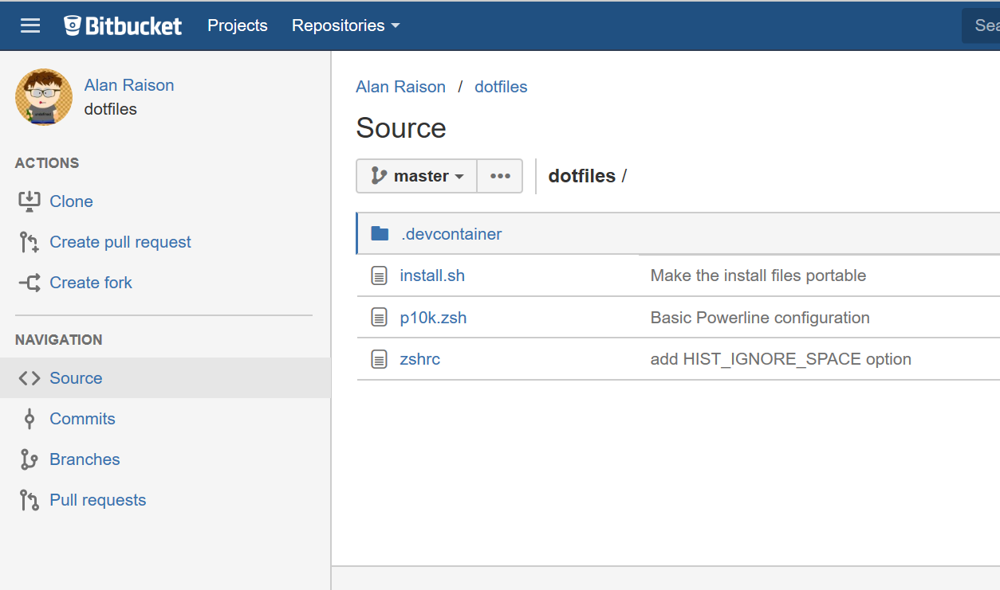
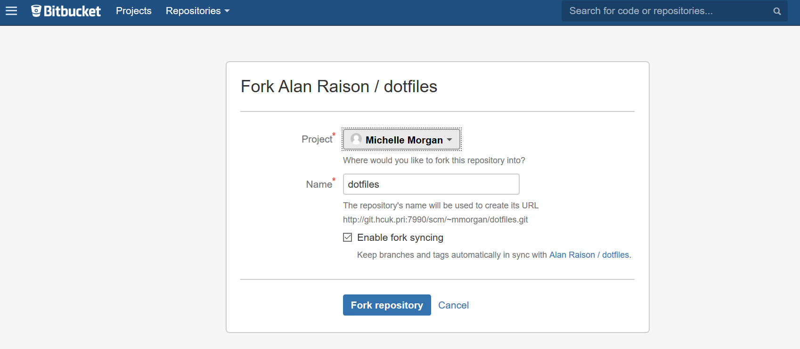

dotfiles
========

Useful dotfiles for setting up your environments consistently.

# How to Use

1. Fork this repository into your own user profile in Bitbucket
    * In the dotfiles repository, click the action "Create Fork":
      
    * Select your user profile as the destination:
      
1. Install the MesloLGS NF fonts from https://github.com/romkatv/powerlevel10k#meslo-nerd-font-patched-for-powerlevel10k
1. Open your VSCode User settings and search for `remote.containers.dotfiles.repository`
1. Set the Dotfiles repository to your new fork of the dotfiles repository
    * The install command should be set to `~/.dotfiles/install.sh`
1. Search for `terminal.integrated.shell.linux` and set to `/usr/bin/zsh` (you have to edit this in the JSON file)
1. Set `terminal.integrated.fontFamily` to MesloLGS NF
1. Rebuild your container
